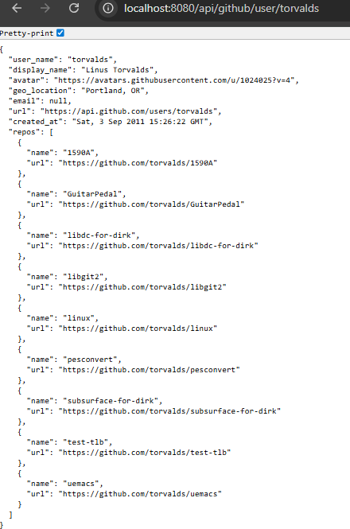

**GitHub-User-Service**

The GitHub-User-Service which I created, is a production-ready, Spring Boot application that uses a clear and consistent REST API to deliver aggregated GitHub user data. It retrieves the user profile details, and the user’s public repositories from the GitHub REST API, and then validates the input, enforces error handling, and exposes a well-structured DTO for the response to the client.

Furthermore, the most important and primary objectives of this service’s design are testability, maintainability, and clarity. The internal architecture of this service promotes deterministic behavior across different environments and enforces a clear division of responsibilities.

**1. Overview**

The goal of the service is to provide an effective way of retrieving and displaying GitHub user information. It exposes a reliable and consistent client-facing API, while abstracting out the inner architecture and potential errors of the GitHub API.

`Key features of this service are:`

    1. Fetching the profile data for a GitHub user.
    2. Fetching and listing all public repositories for a given user.
    3. Aggregating the data and returning a unified response structure.
    4. Clear communication through use of DTOs.
    5. Consistent output of errors through global Exception Handling.
    6. Configuration of timeouts for external API calls.
    7. Fully segregated and testable layers.

**2. Architectural Summary** 

The modular, layered structure of this application will ensure flexibility and ease of maintenance.

 

**Design Explanation**

`Controller Layer — Request Validation & Routing` 

The controller validates incoming requests, as well as provides REST endpoints. Invalid usernames will be filtered out upfront, allowing the rest of the code base to expect valid data in its input.
Service Layer — Orchestration Logic 
The service layer pulls the service together by requesting the user and repositories information from the GitHub client, applying business logic (filtering, merging data, applying limits) and assembling the final response model.

`GitHub Client Layer — External API Integration` 

The GitHub client encapsulates all GitHub API requests via RestTemplate. This allows all HTTP communication logic to be separated, error handling to be centralized, and the service layer to be kept ignorant of API details.

`Mapping Layer — Data Transformation`

A mapper maps raw GitHub API models into the final response model your service will present to the world. This ensures that all changes remain explicit, centralized, and testable.

`Model Isolation — API Models vs. Response Models `

Models that represent the response from GitHub’s API are intentionally separated from the models returned to clients. This ensures that no third-party API fields are leaked into your public API, and it can stay 100% stable even if GitHub changes their API.

`Centralized Exception Handling — Consistent Error Output`
A global exception handler ensures all error responses are predictable, and consistent across endpoints, improving experience and debuggability for clients

**3. API Specification**

Endpoint of this service is
GET /api/github/user/{username}

Example Request is as below
GET http://localhost:8080/api/github/user/octocat

Example Response
{
  "user_name": "octocat",
  "display_name": "The Octocat",
  "avatar": "https://github.com/images/error/octocat_happy.gif",
  "geo_location": "San Francisco",
  "email": null,
  "url": "https://api.github.com/users/octocat",
  "created_at": "Mon, 20 Jan 2010 18:44:36 GMT",
  "repos": [
    {
      "name": "hello-world",
      "url": "https://github.com/octocat/hello-world"
    }
  ]
}
Example Output:

**4. Data Mapping and Transformation** 
The service transforms the raw GitHub API payload into a stable public contract. The key differences between the GitHub API field names (snake_case) and the output field names are documented below.

**Field Renaming**
login (GitHub API) is renamed to user_name (Service Output).
name (GitHub API) is renamed to display_name (Service Output).
avatar_url (GitHub API) is renamed to avatar (Service Output).
location (GitHub API) is renamed to geo_location (Service Output).
repos[*].html_url (Repo API) is mapped to repos[*].url (Service Output).
The created_at field is converted from the GitHub API's ISO 8601 format to the more common RFC 1123 date format.

**5. Running the Application**
    `Prerequisites for this service to work are`
    Java 17+
    Maven 3.9+
    `1. Clone the Repository`
    Open your terminal or command prompt and run the following command to clone the project to your local machine:
    git clone https://github.com/shravyapotu/github-user-service
    cd github-user-service
    `2. Build the Project`
    Use Maven to clean the target directory and build the project, downloading all necessary dependencies:
    mvn clean install
    `3. Run the Application`
    The service can be started using the Spring Boot Maven plugin:
    mvn spring-boot:run
    The application will start on port 8080
    `The endpoint for retrieving user data is:`
    Service Base URL 
    http://localhost:8080/api/github/user/{username}
    `Running Tests`
    To execute all unit tests and verify the implementation, run the following Maven command:
    mvn test
**6. Design Decisions**
`RestTemplate for HTTP Communication`
RestTemplate is being used in this case due to its simplicity and sync by default nature of execution. Furthermore, GitHub API is a RESTful API, with RestTemplate it has very good support and will be reducing any unnecessary reactive complexity while still providing an established, stable and production-ready library for making external service requests..

`Dedicated Mapping Layer`
By having a separate mapper I provide an explicit and clear transformation from an external API model to an internal response model (intention is to have this easy to test, maintain and well factored).

`Separate API Contract Models vs. Response Models`
Separating out an API contract (public facing API) from response model allows to keep the latter stable and decoupled from any potential changes in the GitHub’s internal response payload. This also makes the service easier to maintain and better future proof.

`Unified Error Handling Strategy`
A centralized exception handler helps in serving a consistent error response for all kinds of error responses in a variety of cases, including validation failures, errors from the external API or uncaught/unexpected errors, therefore making error responses predictable and the application easily integratable from the client point of view.

`Input Validation at the Controller Boundary`
Validation logic is placed in a controller itself so that invalid requests never reach the service layer. In addition, since an invalid request, once caught, will prevent any calls to the external API (unwanted traffic/network overhead), won’t lead to accidental external API calls, and also has a clear and deterministic error response that the client will receive, therefore it’s better to handle this scenario at the entry point level.

**7.Testing**

For this project, I created a complete testing infrastructure utilizing JUnit 5 as the primary test framework, along with Mockito for mocking dependencies and Spring Boot Test for validating the controller and integration layers. Each functional layer — controller, service, client, mapper, and global exception handling — has its own dedicated test suite to assure predictable and isolated behavior. By simulating external interactions, I’m able to thoroughly evaluate both success and failure scenarios without relying on genuine API calls. Strong dependability and uniformity throughout the application are guaranteed by this methodical approach. The project presently maintains 80% test coverage, showing the stability and quality of the entire implementation.

**8.Conclusion**

GitHub-User-Service implements a clean and maintainable solution with the following characteristics and features:

• Well-defined architectural boundaries

• Reliable external API interaction

• Input validation

• Thorough error handling

• Consumer-friendly and consistent response model

• High testability across the board

GitHub-User-Service can serve as a good foundation to develop more GitHub or external API-driven microservices in the future.
